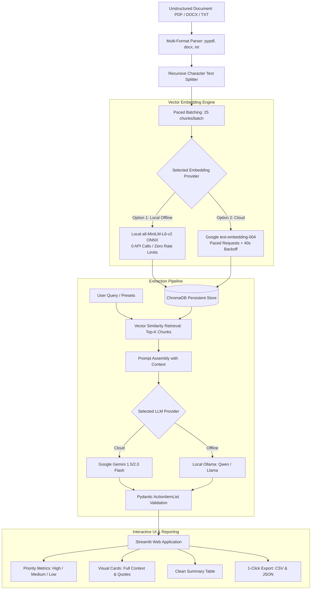

# 📋 RAG-Powered Document Action Extractor

[](https://www.python.org/)
[](https://streamlit.io/)
[](https://www.langchain.com/)
[](https://www.trychroma.com/)
[](https://ai.google.dev/)
[](https://ollama.com/)

A production-grade Retrieval-Augmented Generation (RAG) system that automatically extracts action items, task assignees, deadlines, and urgency levels from unstructured business documents (PDF, DOCX, TXT).

Built with **LangChain**, **ChromaDB**, **Google Gemini**, and local **Ollama** support, featuring rate-limit protections and zero-rate-limit local embeddings.

---

## 🌟 Key Highlights & Problem Solved

Unstructured business documents (meeting minutes, sprint reviews, audit reports, project specs) often contain crucial tasks scattered across pages. Manual review is time-consuming and error-prone. 

This application bridges that gap by offering:
1. **Zero Quota Exhaustion**: Solves Google Free Tier 429 `RESOURCE_EXHAUSTED` rate limits by providing a **Local Embedding Engine** (`all-MiniLM-L6-v2`) that runs 100% on your machine with 0 API calls.
2. **Dual LLM Engines**: Seamlessly switch between **Google Gemini (Cloud)** and **Local Ollama (100% Offline)** models like `qwen3.5-abliterated` or `llama3`.
3. **No Frozen UI**: Paced batching with real-time Streamlit progress callbacks.
4. **Structured & Auditable**: Every task is validated against strict Pydantic schemas and linked back to the exact source quotation from the document.
5. **Full Visibility & Exports**: Color-coded visual cards with zero text cut-offs, plus one-click **CSV** and **JSON** exports.

---

## 🏗️ Architecture Workflow



---

## 🚀 Features

- **Multi-Format Ingestion**:
  - `.pdf` parsed via `pypdf`
  - `.docx` parsed via `python-docx`
  - `.txt` read directly as UTF-8
- **Dual Embedding Options**:
  - **Local (all-MiniLM-L6-v2)**: Fast CPU inference, zero cost, completely offline.
  - **Google Gemini (text-embedding-004)**: Batched ingestion with automatic 40s+ exponential backoff.
- **Dual LLM Provider Support**:
  - **Google Gemini Flash**: Blazing fast cloud inference.
  - **Local Ollama**: 100% offline, privacy-first local LLM inference.
- **Interactive Web Interface**:
  - Quick query presets: *All Action Items*, *High Priority Only*, *Deadlines & Due Dates*, *Assigned to People*.
  - Full-width visual cards with color-coded priority borders (🔴 High, 🟡 Medium, 🟢 Low).
  - Clean summary table view with responsive columns.
  - One-click downloads for **CSV** and **JSON**.

---

## 🛠️ Tech Stack

| Category | Technology |
| :--- | :--- |
| **Language** | Python 3.10+ |
| **Frontend UI** | Streamlit |
| **Orchestration** | LangChain & LangChain Community |
| **Vector Database** | ChromaDB (Local Persistent) |
| **Cloud LLM & Embeddings** | Google Gemini (`gemini-1.5-flash`, `text-embedding-004`) |
| **Local LLM & Embeddings** | Ollama (`huihui_ai/qwen3.5-abliterated:9b`) & ONNX `all-MiniLM-L6-v2` |
| **Data Validation** | Pydantic v2 |
| **Document Parsers** | `pypdf`, `python-docx` |
| **Data Handling** | Pandas |

---

## 📦 Setup & Quickstart

### 1. Clone the repository
```bash
git clone https://github.com/keshav-x/rag-action-extractor.git
cd rag-action-extractor
```

### 2. Create and activate a virtual environment
**On Windows (PowerShell):**
```powershell
python -m venv .venv
.\.venv\Scripts\Activate.ps1
```

**On macOS/Linux:**
```bash
python3 -m venv .venv
source .venv/bin/activate
```

### 3. Install requirements
```bash
pip install -r requirements.txt
```

### 4. Configure Environment Variables
Copy `.env.example` to `.env`:
```bash
cp .env.example .env
```
Inside `.env`, add your Google Gemini API key:
```env
GOOGLE_API_KEY=your_actual_api_key_here
```
*(Alternatively, you can enter your API key directly in the web app sidebar at runtime!)*

### 5. Launch the Application
```bash
streamlit run app.py
```
Open your browser and navigate to **`http://localhost:8501`**.

---

## 📂 Project Structure

```text
rag-action-extractor/
├── app.py              # Streamlit web application (UI, tabs, metrics, visual cards, exports)
├── ingest.py           # Document loading, text chunking, batching & vector persistence
├── rag.py              # ChromaDB vector retrieval & LLM action extraction (Gemini + Ollama)
├── models.py           # Pydantic schemas (ActionItem, ActionItemList)
├── utils.py            # DataFrame formatting, CSV/JSON export & markdown cleaning
├── requirements.txt    # Project dependencies
├── .env.example        # Environment variable template
├── .env                # Local API key configuration (git-ignored)
└── data/               # Sample test files and uploaded documents
    ├── sample_meeting_minutes.docx   # Rich Word document test file
    ├── sample_meeting_minutes.txt    # Plain text test file
    └── sample.pdf                    # PDF test file
```

---

## 🧪 Testing with Sample Files

The repository comes pre-packaged with sample documents in the [`data/`](./data/) directory:
1. Open **Tab 1: Upload & Ingest Document** in the web app.
2. Upload `data/sample_meeting_minutes.docx` or `data/sample_meeting_minutes.txt`.
3. Click **"📥 Process & Index Document"**.
4. Switch to **Tab 2: Extract & Analyze Actions** and click **"🚀 Extract Action Items"** to view structured tasks, owners, deadlines, priority tags, and source citations.
5. Export results using the **Download as CSV** or **Download as JSON** buttons.

---

## 📄 License
This project is open-source and available under the [MIT License](LICENSE).
